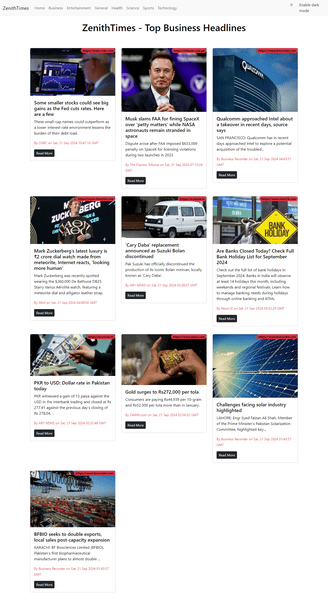
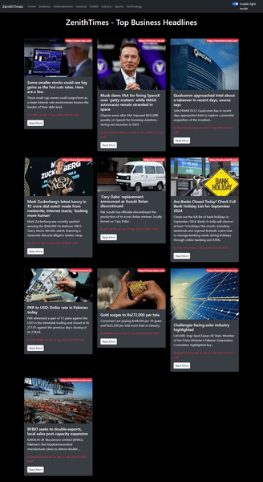

# ZenithTimes: Stay Informed with the Latest News

📰 Welcome to **ZenithTimes**, a React-based web application that delivers the latest news directly to your browser. This application features infinite scrolling, dark/light mode, and category-based news filtering. Below you will find detailed instructions on how to use the application and information on the available features.

## Table of Contents

1. [Introduction](#introduction)
2. [Features](#features)
   - [Infinite Scrolling](#infinite-scrolling)
   - [Dark/Light Mode](#dark-light-mode)
   - [Category Filtering](#category-filtering)
   - [Responsive Design](#responsive-design)
3. [Installation](#installation)
4. [Usage](#usage)
   - [General Instructions](#general-instructions)
   - [Category-Specific Instructions](#category-specific-instructions)
5. [API Integration](#api-integration)
6. [Contributing](#contributing)
7. [License](#license)
8. [Contact](#contact)

## Introduction

**ZenithTimes** is a news aggregation platform built with React, allowing users to browse and read news articles from various categories. It provides a smooth, user-friendly experience with features like infinite scrolling, theme toggling, and responsive design to ensure compatibility across devices.

## Features

### Infinite Scrolling

Automatically loads more news articles as the user scrolls down the page, ensuring a seamless browsing experience.

### Dark/Light Mode

Toggle between dark and light themes for a better reading experience based on user preference. The theme is saved locally and applied on subsequent visits.

### Category Filtering

Browse news articles based on different categories such as General, Technology, Sports, etc. The app dynamically fetches articles based on the selected category.

### User Interface Overview
### Home Page
The **ZenithTimes** home page is designed to offer users an immersive and seamless news-reading experience, with intuitive navigation and smooth interactions. Below is a breakdown of the key elements:

- **Navigation Bar**: Positioned at the top of the page, the navigation bar includes:

- **Category Links**: Tabs for different news categories like General, Technology, Sports, and more, allowing users to filter news based on their interests.
Dark/Light Mode Toggle: A switch in the top right corner for users to toggle between dark and light themes. The toggle ensures the app adapts to user preferences, with the theme stored locally for future visits.
News Feed (Infinite Scrolling): The main section of the page is dedicated to the news feed:

- **Article Cards**: Each article is presented in a card format, showing a thumbnail image, headline, a brief description, and a publication date.
Infinite Scroll: As the user scrolls down, more news articles automatically load without needing to click or navigate, ensuring a smooth, uninterrupted reading experience.
Category-Specific Filtering: When a user selects a category from the navbar, the articles in the news feed dynamically update to reflect the most recent and relevant news within that category.

- **Responsive Design**: The layout adapts seamlessly to different devices:

- **Desktop View**: Articles are presented in a grid format, with multiple columns for efficient browsing.
- **Mobile View**: The grid collapses into a single column, making the articles easy to browse and read on smaller screens without compromising readability.
Footer Section: At the bottom of the page, the footer includes links to social media profiles, a brief description of the app, and legal disclaimers such as the terms of use and privacy policy.

This design ensures that ZenithTimes provides a fluid, engaging experience regardless of device or browsing habits.




### Responsive Design

The app is fully responsive and works seamlessly on desktops, tablets, and mobile devices.

## Installation

To install and run this application locally, follow these steps:

1. **Clone the repository:**

   ```bash
   git clone https://github.com/Armish11/ZenithTimes-React.git
   ```

2. **Navigate to the project directory:**
   ```bash
   cd ZenithTimes-React
   ```
3. **Install dependencies using npm:**
   ```bash
   npm install
   ```
4. **Start the development server:**
   ```bash
   npm start
   ```
5. **Open your web browser and navigate to:**
   ```bash
   http://localhost:3000
   ```
###   Usage
1. General Instructions
2. Open the app in your web browser.
3. Select a category from the navbar to view news articles related to that category.
4. Scroll down to load more articles automatically.
5. Toggle between dark and light mode using the button in the navbar.
6. Category-Specific Instructions
7. To change the category, simply click on a different category in the navbar.
8. The app will automatically fetch and display the latest news for the selected category.
9. API Integration
10. The application uses the GNews API to fetch news articles. The API key and other configuration details can be set in  the .env file.


## Contributing

We welcome contributions to improve this application. Please follow these steps:

1. Fork the repository or clone it locally:
   ```bash
   git clone https://github.com/Armish11/ZenithTimes-React.git
   ```
2. Create a new branch:
   ```bash
   git checkout -b feature-branch
   ```
3. Make your changes and commit them:
   ```bash
   git commit -m "Description of changes"
   ```
4. Push to the branch:
   ```bash
   git push origin feature-branch
   ```
5. Open a pull request on GitHub if you would like to propose your changes.


### License
This project is licensed under the MIT LICENSE. See the [LICENSE](./LICENSE)file for more details.

## Contact

If you have any questions, feedback, or suggestions, feel free to contact me on [GitHub](https://github.com/Armish11). I'll be happy to assist!


